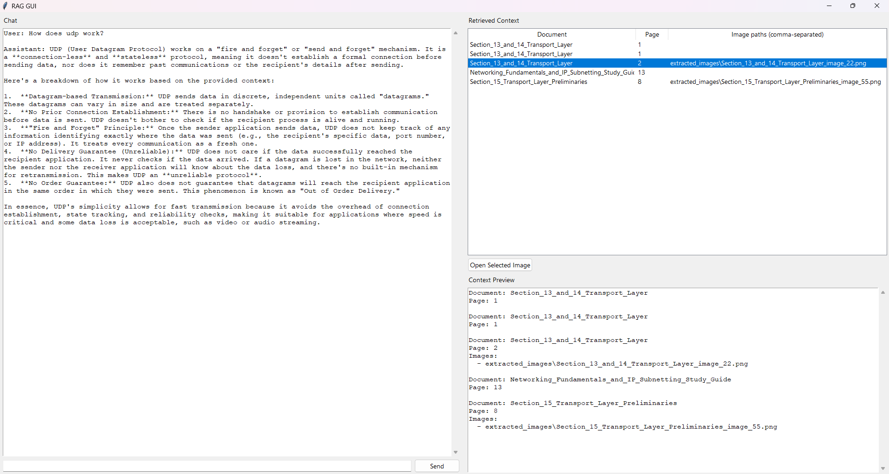

# A PDF-RAG system with local file embeddings

A working PDF retrieval-augmented generation (RAG) prototype using a Tkinter desktop UI, ChromaDB, local sentence embeddings, and Google Gemini. The application retrieves relevant PDF chunks, sends those chunks to Gemini, and shows the source document, page, and extracted-image paths beside the answer.

For my personal useage, I have used the free-tier Gemini API which comes with limited requests to the the Gemini. But, if one has a paid version, that will also work without any changes to the program. Just store the API key in a ```.env``` file in this folder with a variable name ```GEMINI_API_KEY```. 

## How it works

1. PDFs in [pdfs/](pdfs) are scanned with PyMuPDF. The ```pdfs``` folder is not included in the repo. The user needs to make one and store all the pdfs there. 
2. Text and embedded images are extracted. The parser writes page-level data to [jsondump/result.json](jsondump/result.json) and saves images in [extracted_images/](extracted_images).
3. `chunker` converts each page into a LangChain `Document` and splits text with `RecursiveCharacterTextSplitter` using a 1,000-character chunk size and 20-character overlap. Metadata includes the document name, zero-based page number, chunk ID, image IDs, and image paths.
4. `embedder` creates normalized `sentence-transformers/all-MiniLM-L6-v2` embeddings and stores them with the text and metadata in the `pdf_collection` Chroma collection under [chroma_db/](chroma_db).
5. `retriever` embeds the question with the same local model. The UI retrieves the five nearest chunks from Chroma.
6. `LLMAPI` sends the question and retrieved context to Gemini `gemini-2.5-flash` and returns the generated answer.

## GUI example

The supplied example shows the final Tkinter layout in operation:

- The left pane contains the conversation and question input.
- The right pane lists the five retrieved records with document, page, and image-path metadata.
- Selecting a row and pressing **Open Selected Image** opens the first extracted image with the operating system's default image viewer.
- The context preview shows the retrieved source metadata used for the answer.



> `gui-example.png` is the screenshot supplied with the project description. Copy the supplied screenshot into the repository root with this filename when publishing the README so the image is rendered by GitHub or another Markdown viewer.

## Repository structure

- [app.py](app.py) — Tkinter RAG chat application. It opens or builds the Chroma dataset, retrieves five results, calls Gemini, and updates the chat and context panes.
- [pdf_extractor.py](pdf_extractor.py) — extracts page text and embedded images from PDFs.
- [chunker.py](chunker.py) — creates and splits LangChain documents while preserving source metadata.
- [embedder.py](embedder.py) — embeds chunks locally and creates the `pdf_collection` Chroma collection.
- [retriever.py](retriever.py) — creates query embeddings with the same local embedding model.
- [llm_api.py](llm_api.py) — loads `GEMINI_API_KEY` and calls Gemini.
- [test_main.py](test_main.py) — command-line integration example for retrieval and answer generation.
- [APITestCode.py](APITestCode.py) — standalone Gemini API example.
- [requirements.txt](requirements.txt) — base project dependencies.
- [pdfs/](pdfs) — input PDFs.
- [jsondump/](jsondump) — extracted page-level JSON.
- [extracted_images/](extracted_images) — images extracted from PDFs.
- [chroma_db/](chroma_db) — persisted Chroma data.

## Setup

Use Python 3.9 or newer. From the project root, activate the included environment if needed:

```powershell
PythonEnv\Scripts\Activate.ps1
```

Install the dependencies:

```powershell
python -m pip install -r requirements.txt
```

The current implementation also imports the following packages, which must be available in the environment:

```powershell
python -m pip install langchain-core langchain-text-splitters langchain-huggingface sentence-transformers
```

Create `.env` in the project root:

```env
GEMINI_API_KEY=your_api_key_here
```

## Run the application

Place at least one PDF in [pdfs/](pdfs), then run:

```powershell
python app.py
```

On startup, the application opens the existing `pdf_collection`. If it cannot find the collection, it extracts the PDFs, creates chunks and embeddings, and builds the local database automatically. Enter a question and press **Send** or **Enter**.

To test Gemini without the RAG pipeline:

```powershell
python APITestCode.py
```

To run the command-line retrieval example against an existing Chroma collection:

```powershell
python test_main.py
```

## Current limitations

- Page numbers shown in the UI are zero-based because they come directly from the parser's page enumeration.
- The Chroma collection is created with `create_collection`; rebuilding an existing database may require removing or renaming the existing `pdf_collection` first.
- The Gemini request requires a valid `GEMINI_API_KEY` and network access.
- The UI displays image paths and opens the first image from the selected result; it does not render images inside the window.

### If anyone wants any improvements or sees any flaws which should be corrected, feel free to open a branch or make a fork. I will be happy to collaborate on this project. 
